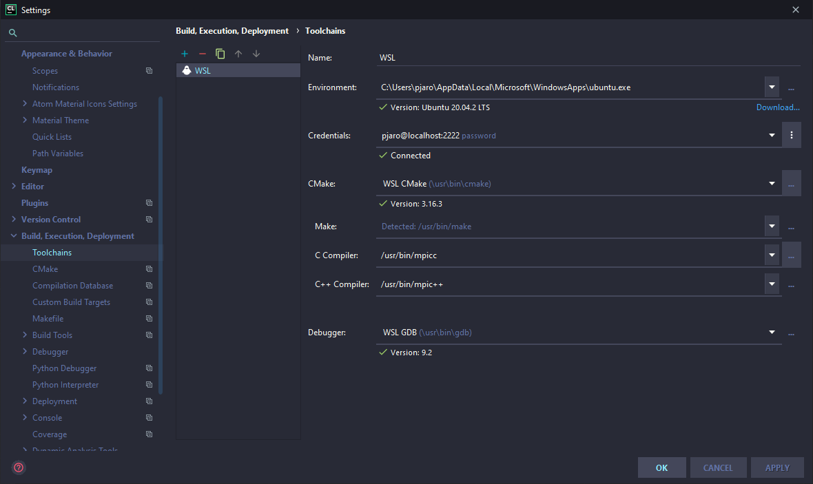
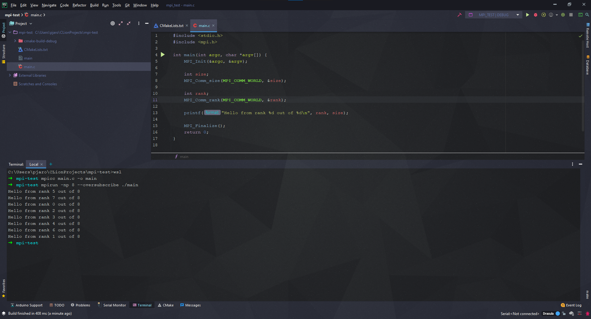

### 1. Install mpi inside your wsl

```shell
> sudo apt install -y libopenmpi-dev
```

### 2. You should now be able to access `mpicc` and `mpirun`

##### 2.1 Check if you can access `mpicc`

```shell
> which mpicc
  /usr/bin/mpicc
```

##### 2.2 Check if you can access `mpirun`

```shell
> which mpirun
  /usr/bin/mpirun
```

### 3. Find the `mpi.h` file

```shell
> find /usr/lib | grep mpi\\.h
  /usr/lib/x86_64-linux-gnu/openmpi/include/mpi.h
```

### 4. Add the catalog to the `CMakeLists.txt` file to enable code insight features

```txt
cmake_minimum_required(VERSION 3.16)
project(mpi_test C)

set(CMAKE_C_STANDARD 11)

include_directories(/usr/lib/x86_64-linux-gnu/openmpi/include/)
add_executable(mpi_test main.c)
```

### 5. Configure CLion to use WSL Toolchain



### 6. Compile and run the program

##### I don't know if it's possible to configure CLion to use `mpirun` as runner but you can do it manually from internal terminal

##### 6.1 Enter the wsl

```shell
> wsl
```

##### 6.2 Compile the program

```shell
> mpicc main.c -o main
```

##### 6.3 Run the program

```shell
> mpirun -np 8 --oversubscribe ./main
```


